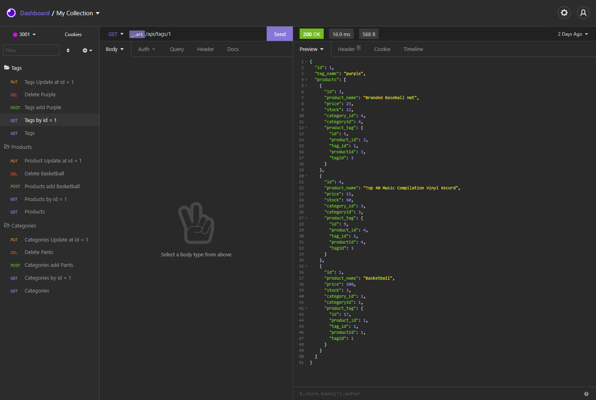

# E-Commerce

</p<
 

<h3>Table of Contents</h3>

  <ol>
    <li><a href="#description">Description</a></li>
    <li><a href="#demonstration">Demonstration</a></li>
    <li><a href="#screenshots">Screenshots</a></li>
    <li><a href="#usage">Usage Information</a></li>
    <li><a href="#contribute">Contributors</a></li>
    <li><a href="#license">License</a></li>
    <li><a href="#questions">Questions</a></li>
  </ol>

<h2 id='description'>Description</h2>

This is a backend application that implaments the use of an API client. Managing a database by using GET, POST, PUT, and DELETE requests will allow the user to manipulate the data stored on the backend.
This application comes with seeds to test out the database, but will allow the user to create their own database of products. Each separated by category, product, and tag. 
 

<h2 id='demonstration'>Demonstration</h2>

<a href='https://drive.google.com/file/d/12-ffO1NGnVw_mFdoN9z-PqDcUM4ow34B/view?usp=sharing'>Link to Video</a>
 

<h2 id='screenshots'>Screenshots</h2>
preview: 
  
 

<h2 id='usage'>Usage Information</h2>
To run the application: 
1. download dependencies: <code>npm i</code> 
2. log into mysql and start the database by running:  <code>SOURCE db/schema.sql</code>  
3. to seed the database, run   <code>npm run seed</code> 
4. run: <code>npm start</code> or <code>npm watch</code> to run it with nodemon 
5. launch your API client and run at localhost:3001

 

<h2 id='contribute'>Contributors</h2>

If you would like to contribute to this project, fork it and then submit a pull request. If there are any issues/suggestions, please submit a 
an issues ticket.
 

<h2 id='license'>License</h2>
All rights granted under this License are granted for the term of copyright on the Program, and are irrevocable provided the stated conditions are met. This License explicitly affirms your unlimited permission to run the unmodified Program. The output from running a covered work is covered by this License only if the output, given its content, constitutes a covered work. This License acknowledges your rights of fair use or other equivalent, as provided by copyright law.  

You may make, run and propagate covered works that you do not convey, without conditions so long as your license otherwise remains in force. You may convey covered works to others for the sole purpose of having them make modifications exclusively for you, or provide you with facilities for running those works, provided that you comply with the terms of this License in conveying all material for which you do not control copyright. Those thus making or running the covered works for you must do so exclusively on your behalf, under your direction and control, on terms that prohibit them from making any copies of your copyrighted material outside their relationship with you.

To read more about this license, please follow this [link](https://www.gnu.org/licenses/gpl-3.0). 
 

<h2 id='questions'>Questions</h2>

If you have any questions or issues, please email me at r.paragas@outlook.com.

For any further information, here is my [github page](https://github.com/ParagasR).
